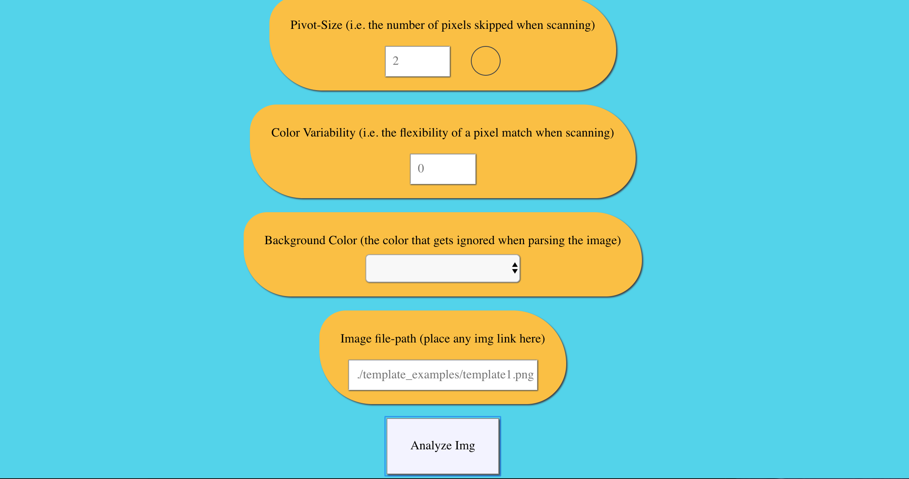
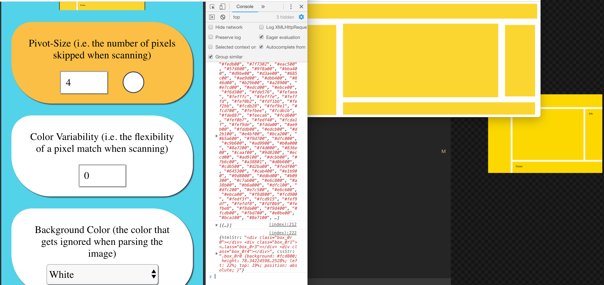

# Imageto-HTML
### A feature recognition app that analyzes an image to make a webpage
## LIVE on Github pages
- [Live Demo](https://parisdreyer.github.io/image-to-html/)
- Be sure to enable the ability to `open windows` on your browser for the Demo page
    - If you do not do so, you will be prompted to do so after clicking the `Analyze Image` button. Click the `Analyze Image` Button one more time after enabling open windows
- For a demo of the features, click the `Analyze Image` button at the bottom of the Live Demo
    - You can additionally demo:
        - template_examples/template2.png
        - template_examples/template3.png
        - template_examples/template4.png
        - template_examples/template5.jpeg
        - template_examples/template6.png
        - template_examples/template7.png
        - template_examples/template8.jpeg
        - template_examples/template9.jpeg
    - input a full url to the image you want to generate a web-page out of
    
## Features
### Basic Functionality
    - Input the url to the `Image File Path` input box above the `Analyze Image Button`
    - Update the `Pivot Size` and `Color Variability` -- the smaller the Pivot Size the slower the calculations are. The larger the color variability the slower the calculations.
    - Uses a pivot algorithm in concert with a seed-fill algorithm and random sampling to generate statistically likely color groups from an array of pixels.
        - After generating color groups CSS and HTML files are generated using the relative height, width and position of each color region
    
     